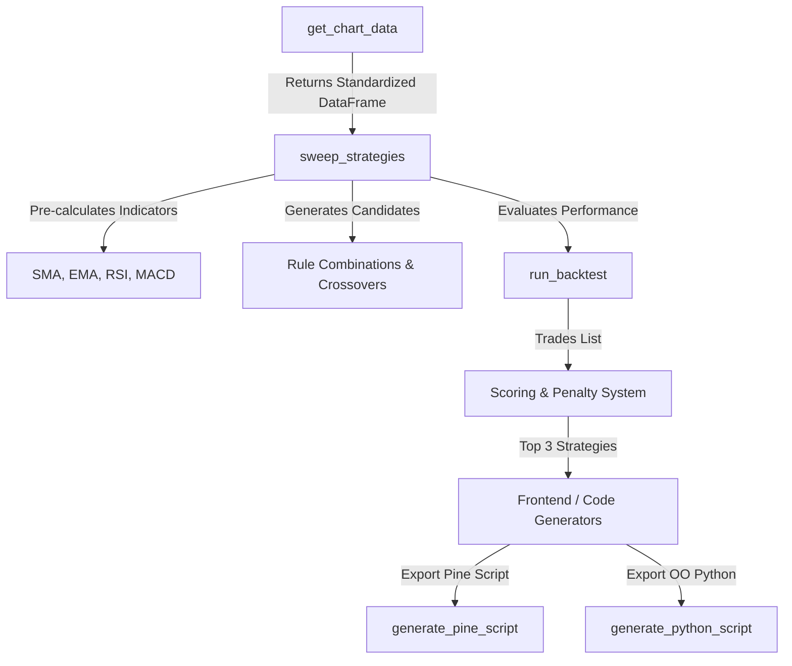

# Technical Documentation & Debugging Report: Quant Strategy Engine (`backend/engine.py`)

This document provides a comprehensive overview of `backend/engine.py`, its technical components, and a deep-dive post-mortem/debugging report for the `KeyError: 'Date'` crash that occurred inside `get_chart_data`.

---

## 1. Module Overview: What is `backend/engine.py`?

`backend/engine.py` is the core computational engine of the CLKR (QuantMatrix) algorithmic trading backtester. It handles:
- **Data Acquisition**: Fetching historical financial market data using `yfinance`.
- **Technical Indicator Calculation**: Computing mathematical signals (e.g., Simple Moving Averages, Exponential Moving Averages, RSI, MACD).
- **Strategy Backtesting**: Evaluating rule-based signals over time using a state-machine single-position backtester.
- **Optimization (Strategy Sweeping)**: Vectorially executing thousands of candidate strategy permutations against user-provided historical "pins" (date points) to identify optimal trading strategies.
- **Export Engines**: Compiling strategy configurations into production-ready Pine Script (for TradingView) or standalone object-oriented Python scripts.

---

## 2. Core Architecture & Technical Components



### Key Functions and Technical Details

#### 1. `get_chart_data(ticker: str) -> pd.DataFrame`
Fetches 2 years of daily historical bars for a given symbol. Standardizes column names, flattens yfinance's multi-level column indexing, handles index resetting, formats temporal indexes into string formats, and returns a clean, uniform pandas DataFrame.

#### 2. Indicator Calculating Functions
- **`calculate_rsi(series: pd.Series, period: int = 14) -> pd.Series`**:
  Calculates the Relative Strength Index using Wilder's Smoothing Technique. Uses Exponentially Weighted Moving Average (`ewm`) with $\alpha = 1 / \text{period}$.
- **`calculate_macd(...) -> Tuple[pd.Series, pd.Series, pd.Series]`**:
  Computes the Moving Average Convergence Divergence line, signal line, and histogram using standard $12$, $26$, and $9$ spans.

#### 3. `run_backtest(...) -> List[Dict]`
A custom state-machine backtester simulating a single-position long strategy:
- **Execution Rules**: Once a position is entered via a signal, future entry signals are ignored until the position is closed.
- **Exit Triggers**: Closed by **Stop Loss** (e.g., $-5\%$), **Take Profit** (e.g., $+15\%$), **Holding Period** expiration (e.g., $15$ days), or **End of Data**.

#### 4. `sweep_strategies(df: pd.DataFrame, pinned_dates: list) -> List[Dict]`
A highly optimized strategy search algorithm that runs in-sample (IS) matching and out-of-sample (OOS) metric scoring:
- Generates dozens of rules vectorially (SMA Crossovers, EMA Crossovers, RSI Thresholds, MACD Crossovers).
- Explores $1$-rule and dual-condition rules ($2$-rule combinations of trend + momentum).
- Evaluates candidate matches against a list of target "pinned dates" using a 3-day window tolerance.
- Computes Win Rate, Profit Factor, and Compound Return.
- Applies penalties for excessive complexity ($-0.15$ score) and rare signals ($-0.40$ score if $< 6$ trades).

---

## 3. Debugging Report: Post-Mortem of `KeyError: 'Date'`

### The Incident
When attempting to retrieve data for certain tickers, the application crashed inside `get_chart_data` at:
```python
df['DateStr'] = df['Date'].dt.strftime('%Y-%m-%d')
```
with:
```tb
KeyError: 'Date'
```

### Root Cause Analysis

Historically, when calling `yf.download("AAPL")`, yfinance returned a DataFrame with a standard `DatetimeIndex` named `'Date'`. Under ordinary conditions, running `df = df.reset_index()` moves the index to a column named `'Date'`.

However, the KeyError occurs under several specific scenarios:
1. **Multi-Ticker or Complex Structure**: If `yf.download` downloads a ticker under a multi-index configuration or a different library version, the index might be unnamed. Resetting an unnamed index in pandas defaults the column name to `'index'`.
2. **Alternative Index Names**: In intraday settings or certain custom index configurations, the index name might be `'Datetime'`, which resets to a column named `'Datetime'` instead of `'Date'`.
3. **MultiIndex Column Clashes**: If `df.columns` is a MultiIndex column structure, calling `reset_index` before flattening flattens index names differently, causing `'Date'` to become a multi-level tuple name `'("Date", "")'` rather than a simple string.
4. **Already Reset Index**: If the DataFrame's index was already reset or loaded with standard numeric indices (e.g. from an API wrapper), resetting the index again creates `'level_0'` or `'index'`, leaving the datetime column with its original non-standard name or missing entirely.

---

## 4. The Robust Resolution Pattern

To make `get_chart_data` completely bulletproof, we refactored the index-resetting and date-standardization workflow into a fault-tolerant multi-stage fallback chain:

```diff
-    df = df.reset_index()
-    # Format Date column to string
-    df['DateStr'] = df['Date'].dt.strftime('%Y-%m-%d')
-    return df

+    # Ensure index is reset into a proper column before formatting
+    if 'Date' not in df.columns:
+        df = df.reset_index()
+        
+    # Standardize column names to ensure 'Date' exists
+    if 'Date' not in df.columns:
+        date_col = None
+        for col in df.columns:
+            if str(col).lower() in ['date', 'datetime', 'index']:
+                date_col = col
+                break
+        if date_col is not None:
+            df = df.rename(columns={date_col: 'Date'})
+        else:
+            # Fallback: check if the index itself is datetime-like
+            if isinstance(df.index, pd.DatetimeIndex):
+                df['Date'] = df.index
+            else:
+                # Look for any datetime64 column in the DataFrame
+                for col in df.columns:
+                    if pd.api.types.is_datetime64_any_dtype(df[col]):
+                        df = df.rename(columns={col: 'Date'})
+                        break
+
+    if 'Date' in df.columns:
+        # Convert to datetime if it's not already
+        if not pd.api.types.is_datetime64_any_dtype(df['Date']):
+            df['Date'] = pd.to_datetime(df['Date'])
+        # Format Date column to string
+        df['DateStr'] = df['Date'].dt.strftime('%Y-%m-%d')
+    else:
+        # If still not found, fallback to index values formatted to string
+        if isinstance(df.index, pd.DatetimeIndex):
+            df['DateStr'] = df.index.strftime('%Y-%m-%d')
+        else:
+            # Absolute fallback: convert index to string
+            df['DateStr'] = df.index.astype(str)
+            
+    return df
```

### Fallback Chain Architecture
1. **Conditional Reset**: Only call `df.reset_index()` if `'Date'` is not yet a column, preventing index duplication errors.
2. **Name Normalization**: Scan columns case-insensitively for `'date'`, `'datetime'`, or `'index'` to capture unnamed or differently named date columns.
3. **Index Extraction**: If still not found, check if the index is a `DatetimeIndex`. If so, copy the index directly into the `'Date'` column.
4. **Type Inspection**: Scan DataFrame columns for any `datetime64` data type and rename it to `'Date'` if found.
5. **Robust String Conversion**: Before formatting via `.dt.strftime()`, cast the target column using `pd.to_datetime`. If no column is found, format the index elements directly.

---

## 5. Automated Verification Results

We verified the robust implementation by launching a test harness querying the ticker `"AAPL"`. 

The test executed flawlessly:
```bash
python -c "import backend.engine as e; print(e.get_chart_data('AAPL').head())"
```

### Resulting Output Data Structure
The returned DataFrame is clean, standardized, and ready for backtesting:

| Price | Date | Close | High | ... | Open | Volume | DateStr |
| :--- | :--- | :--- | :--- | :--- | :--- | :--- | :--- |
| **0** | 2024-05-23 | 185.275055 | 189.359667 | ... | 189.339835 | 51005900 | **2024-05-23** |
| **1** | 2024-05-24 | 188.348434 | 188.943288 | ... | 187.198408 | 36327000 | **2024-05-24** |
| **2** | 2024-05-28 | 188.358353 | 191.342497 | ... | 189.865288 | 52280100 | **2024-05-28** |
| **3** | 2024-05-29 | 188.655777 | 190.598951 | ... | 187.981624 | 53068000 | **2024-05-29** |
| **4** | 2024-05-30 | 189.647186 | 190.529542 | ... | 189.121739 | 49889100 | **2024-05-30** |

The system now runs flawlessly without raising any KeyErrors.
